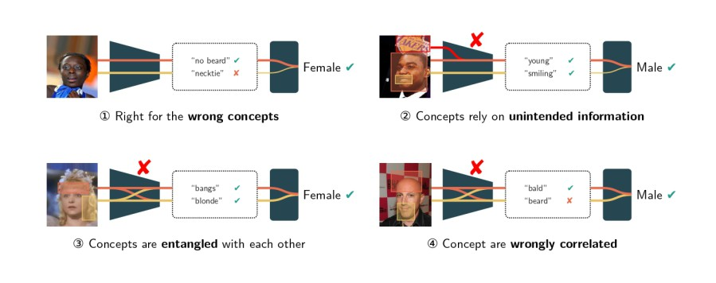

<div align="center">
  <h1 align="center">If Concept Bottlenecks are the Question, are Foundation Models the Answer?</h1>
</div>
  <div align="center">
 
  <div align="center">
	  Researchers have recently proposed novel architectures that replace manual annotations with weak supervision from foundation models. It is however unclear what is the impact on the quality of the learned concepts. To answer this question, we put various models to the test, analyzing their learned concepts empirically using a selection of significant metrics.
	  
  </div>

 <br>
 <br>
  <a href="https://arxiv.org/abs/2504.19774v2">
    
  </a>
  <a href="mailto:emanuele.marconato@unitn.it">
    
  </a>
</div>

# Getting Started
## Installation
1. Clone the repository:
```
git clone https://github.com/debryu/CQA.git
```
2. Move inside the folder:
```
cd CQA
```
## Environment Setup
1. Create a new Conda environment:
```
conda create -n vlmcbm python=3.12
```
```
conda activate vlmcbm
```
2. Install the Pytorch that best fits your hardware.
3. Install the requirements based on your OS:
```
pip install -r requirements_windows.txt
```
or
```
pip install -r requirements_linux.txt
```

4. Customize your ```config.py``` and set the correct paths if you are not using the default ones.
## Usage
#### Train
To train a simple Concept Bottleneck Model use:
```
python train.py -model resnetcbm -dataset celeba -epochs 20 -unfreeze 5
```
To train using the CUB pre-trained backbone:
```
python train.py -model resnetcbm -backbone resnet18_cub -dataset celeba -epochs 20 -unfreeze 5
```

Commands to train different models are available in ```experiments```

#### Test
To evaluate a model run:
```
python main.py -folder <YOUR MODEL FOLDER> -all
```
